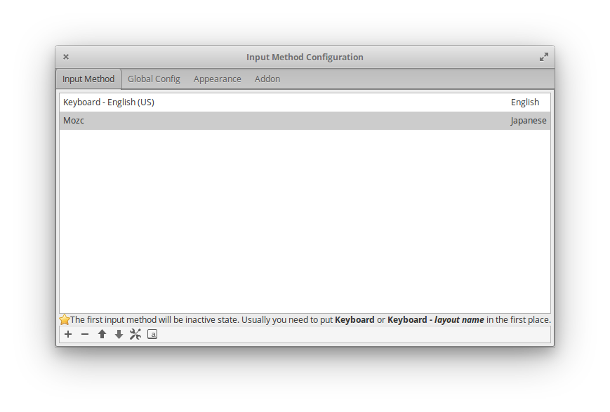
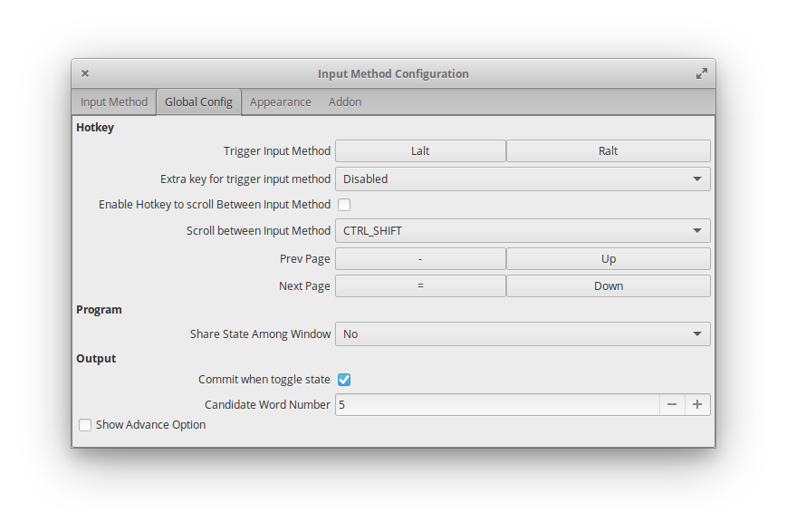
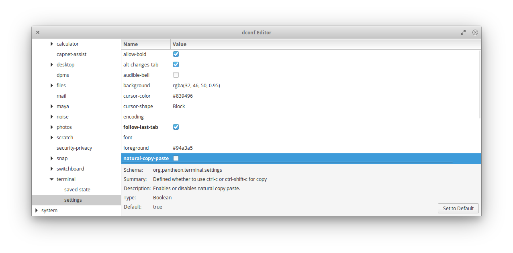

# Xiaomi Mi Notebook Air 13.3にelementary OSをインストールした際の設定

Xiaomi Mi Notebook Air 13.3を手に入れることができたので、Elementary OSをインストールして普段使用しているMacbookのような操作感を実現するためにした設定をメモしておきます。

- Laptop: Xiaomi Mi Notebook Air 13.3 2018
- OS: elementary OS 0.4.1 Loki

## 日本語入力を可能にする


参考: http://note.kurodigi.com/elementary-os-japanese/

Input Method Framework: fcitx、日本語入力メソッド: mozc で設定。

インストール
```
$ sudo apt-get install fcitx-mozc
```

Input Method Frameworkをfcitxにする。
```
$ im-config
```

このあと、ログインし直さないと設定が適用されないようでした。

その後、fcitxのInput MethodにMozcを追加するために、fcitx configurationを開きます。

```sh
$ fcitx-configtool
```

`+`ボタンからmozcを選択して追加。



私はmacと同じように英語と日本語を切り替えられるようにするため、L-AltとR-AltをInput Methodの切り替えのTriggerに設定しました。



また、標準のmozcのiconだと大きくて上のツールバーが日本語に切り替えるたびに高さが変わるので目障りでした。
[ここの記事](https://ivy-box.net/article/20150608.html)を参考にロゴの画像を変えて解決しました。


## PPAを追加できるようにする

普通に追加しようとするとコマンドがないと言われました。

```sh
$ sudo add-apt-repository ppa:nilarimogard/webupd8
$ sudo add-apt-repository: command not found
```

以下をインストールすると使えるようになりました。

```sh
$ sudo apt install software-properties-common
```

参照: https://elementaryos.stackexchange.com/questions/7507/how-can-i-add-a-ppa-in-loki

## Key Mappingを変更する

[xkeysnail](https://github.com/mooz/xkeysnail)を使用して、Caps Lockを単体の入力の場合にはEsc、同時に他のKeyが入力された場合にはCtrlとして振る舞うように設定しました。

```sh
$ sudo apt install python3-pip
$ sudo pip3 install xkeysnail
```

現在のconfigは[こちら](https://github.com/ryom1m1/dotfiles/blob/master/xkeysnail/builtin_keyboard.py)

### Ctrl-V でペーストになっているため、vimのvisual矩形モードが使えない

elementay OSの標準ターミナルであるPantheonでは、Ctrl-Vがクリップボードからペーストする設定になっているため、Vimのvisual矩形モードが使えない。。
Pantheon Terminalの設定はdconfにあるので、dconf-editorで `naturl-copy-paste` を `false` にしました。この設定を適用するとコピー&ペーストにが`Ctrl-Shift-C`, `Ctrl-Shift-V`にマッピングされるので、更にそれをxkeysnailで`Alt-C`と`Alt-V`にマッピングしました。

```sh
$ sudo apt install dconf-tools
$ dconf-editor
```




参照: https://elementaryos.stackexchange.com/questions/2059/how-can-i-disable-natural-copy-paste-in-terminal

### GPUを有効化

Mi Notebook AirにはNvidia GPU MX150が搭載されているので、どうせなら活用したい。ということで、GPUを有効化して Intel ChipsetをGPUのHybrid利用されるようにしました。
標準だと、ただHDMIに画面出力するような場合はIntel Chipsetが使われるようです。Intel Chipsetのみを使ったほうがバッテリーの持ちはいいそうです。

IntelのChipsetとGPUの使い分けを可能にしてくれるBumblebeeをインストールしてみる。
この設定には失敗してOS再インストールするはめになりました。。。

最終的に[ここ](https://elementaryos.stackexchange.com/questions/9803/using-intel-hd-graphics-nvidia-gpu-with-loki)の説明に従ってて最低限の設定はうまく行きました。

現状では `nvidia-settings` を開いてPrimus Settingsから使うDeviceをIntelかNVIDIAか選択して、適用後はログインし直さなければならないという、めんどくさい手順を踏めばIntel ChipsetとGPUを切り替えられるようになりました。
そもそも普通のDesktop PCではこんな切り替えは行わずGPUを使う場合はGPUのカードのポートから出力するようなものだと思うので、結構難しいんだなと思いました。

参考:
- https://wiki.archlinux.org/index.php/Bumblebee#Installation
- https://qiita.com/rainytoffee/items/44deabd66608f00b8544

## その他のインストールしたソフトウェア

### Elementary Tweaks

Ubuntu TweaksのElementary OS版。GUIでの設定の自由度を高めてくれる。

```
sudo add-apt-repository ppa:philip.scott/elementary-tweaks
sudo apt update
sudo apt install elementary-tweaks
```

インストールが完了するとSystem Settingsに Tweaksというアイコンが出現します。

参照: https://ajreissig.com/return-to-elementary-os/

### [Albert](https://github.com/albertlauncher/albert)

MacのLaunchpadのような操作を実現するため、Launcherを入れました。

```
sudo add-apt-repository ppa:nilarimogard/webupd8
sudo apt-get update
sudo apt install albert
```

install後はApplicationsに追加されました。
Macで設定しているのと同じように `Alt+Space` で起動するようにして、検索対象も適当に設定しました。

また、AlbertはStatup Applicationに登録しておくことで、自動で立ち上がるようにしておきました。
Settings > Applications > Statup に追加することで設定できます。

参照: https://ajreissig.com/return-to-elementary-os/

### Google Chrome

Debパッケージをダウンロードしてきて、dpkgでインストール。

```sh
$ sudo dpkg -i google-chrome-stable_current_amd64.deb
```

## ToDo

- Battery節約ツール

